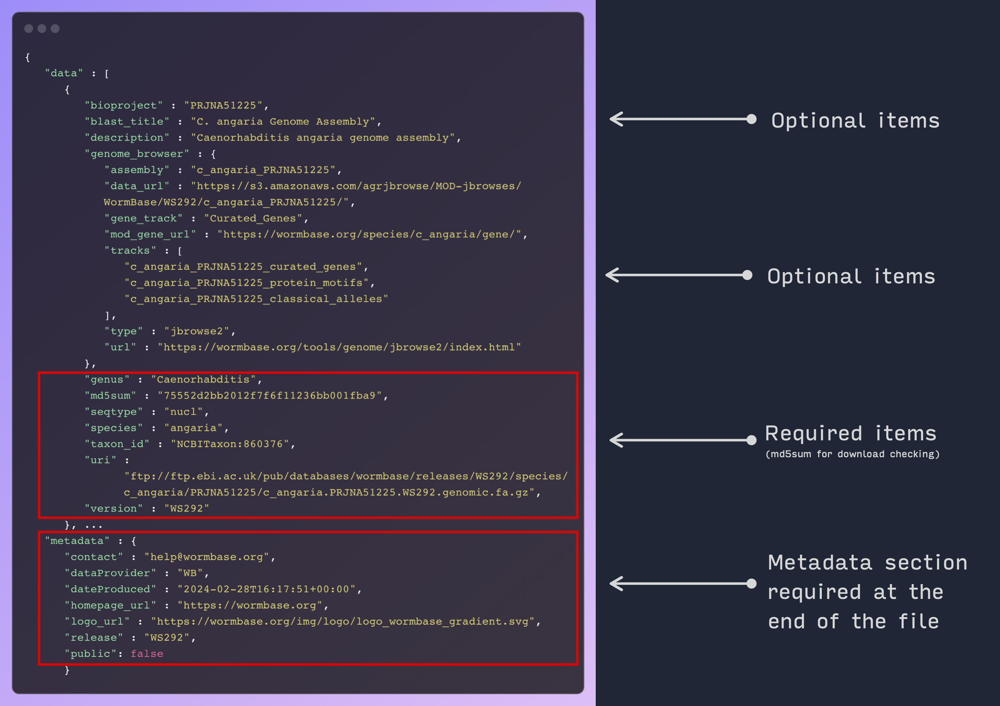

# Creating a JSON Configuration File for Blast Service

The JSON configuration file for the Blast service consists of two main sections: `data` and `metadata`.

The `data` section contains an array of objects, each representing a data source from nucleotide
or protein sequences. The corresponding FASTA files in each element can be single or multiple sequences, from
a single species/genome/proteome or DNA/protein related to a certain biological context.

The `metadata` section contains information about the data provider and the release version of the data.

Each object should have the following properties:

## Data Section

The `data` section is an array of objects, each representing a data source. Each object should have
the following properties (gaphical example below):

- `uri`: The URI where the data source can be accessed. Usually a FTP link. **Required**.
- `bioproject`: The NCBI BioProject ID associated with the data source.
- `blast_title`: A title for the data source that is used in makeblastdb.
- `description`: A description of the data source.
- `genus`: The genus of the organism associated with the data source. **Required**.
- `md5sum`: The MD5 checksum of the data source file, used to check the downloaded file integrity. **Required**.
- `seqtype`: The type of sequences in the data source (e.g., "nucl" for nucleotide sequences,
- "prot" for protein sequences). **Required**.
- `species`: The species of the organism associated with the data source. **Required**.
- `taxon_id`: The NCBI taxon ID of the organism associated with the data source, also used on makeblastdb. **Required**.
- `version`: The version of the data source.

## Metadata Section

The `metadata` section is an object that should have the following properties:

- `contact`: The contact information for the data provider.
- `homepage_url`: The URL of the data provider's homepage, used on the Sequence Server page to link to the MOD/Alliance page
- `logo_url`: The URL of the data provider's logo, also used on the main page.
- `dataProvider`: The name of the data provider.
- `dateProduced`: The date when the data was produced.
- `release`: The release version of the data.
- `public`: A boolean value indicating whether the data is displayed or not on the website.

Here is an example of a JSON configuration file:

```json
{
  "data": [
    {
      "uri": "ftp://ftp.ebi.ac.uk/pub/databases/wormbase/releases/WS286/species/c_angaria/PRJNA51225/c_angaria.PRJNA51225.WS286.genomic.fa.gz",
      "bioproject": "PRJNA51225",
      "blast_title": "C. angaria Genome Assembly",
      "description": "Caenorhabditis angaria genome assembly",
      "genus": "Caenorhabditis",
      "md5sum": "75552d2bb2012f7f6f11236bb001fba9",
      "seqtype": "nucl",
      "species": "angaria",
      "taxon_id": "NCBITaxon:860376",
      "version": "WS286"
    },
    ...
  ],
  "metadata": {
    "contact": "help@wormbase.org",
    "homepage_url": "https://wormbase.org",
    "logo_url": "https://wormbase.org/img/logo/logo_wormbase_gradient.svg",
    "dataProvider": "WB",
    "dateProduced": "2022-08-09T13:08:22+01:00",
    "release": "WS286",
    "public": true
  }
}
```



## JBrowse track links

The JBrowse track links are used to display the data sources in the JBrowse instance.
This section is not required, albeit useful, but it is used to populate links in the Sequence Server blast results
page to link to specific tracks in JBrowse. Each object should have the following properties:


```json
"genome_browser": {
              "type": "jbrowse2",
              "assembly": "c_angaria_PRJNA51225",
              "url": "https://wormbase.org/tools/genome/jbrowse2/index.html",
              "tracks": ["c_angaria_PRJNA51225_curated_genes",
                         "c_angaria_PRJNA51225_protein_motifs",
                         "c_angaria_PRJNA51225_classical_alleles"],
              "gene_track": "Curated_Genes",
              "mod_gene_url": "https://wormbase.org/species/c_angaria/gene/",
              "data_url": "https://s3.amazonaws.com/agrjbrowse/MODjbrowses/WormBase/WS291/c_angaria_PRJNA51225/"
      }
```
